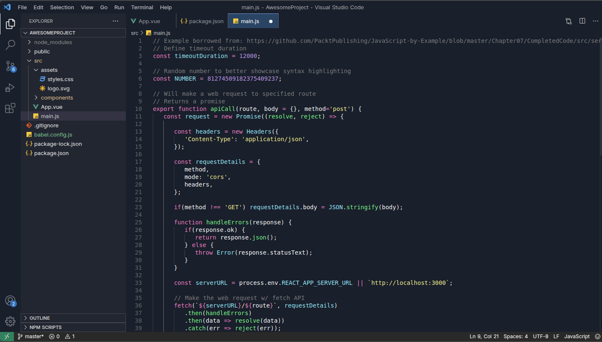

# João Campos Theme

Este tema é uma versão dark criada por mim apelidada com meu nome, para facilitar o uso do VS Code no dia a dia.

### **Mas se já tem diversas extensões de temas prontas para usar por que criar uma?**

Porque as extensões que testei do VS Code não atenderam 100% minhas preferências.

Gosto o tema dark com cor azul escuro, bem clean e elegante, dando alto contraste entre o texto e o fundo. Algo que me incomodava muito na demais extensões do VS Code era que ao estar com um arquivo aberto e diversos outros arquivos abertos, não conseguia localizar qual arquivo estava aberto de maneira rápida, só batendo o olho. Pensando nisso, criei o tema João Campos que une as cores que mais gosto e acho agradável aos olhos e tendo este alto contraste nos arquivos selecionados e abertos. 

## Autor

    

- João Campos
- github: https://github.com/joaonevescampos

# Update Theme
Para atualizar o tema, 
0) Clone este repositório, faça suas alterações no themes/joao-themes.json;
1) rode: `sudo npm install -g vsce`;
2) Mude a versão no package.json
3) Gere um novo .vsix:`vsce package` e exclua o anterior;
4) Publique no Markeplace da Microsoft: `vsce publish` - Crie uma conta na Microsoft, caso não tenha.

## Licença
ISC